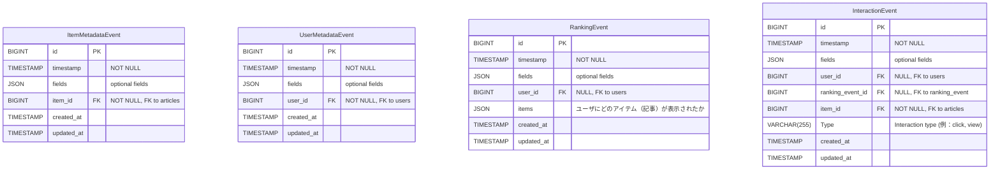

## 概要
- 記事、ユーザ、ユーザのアクションデータを収集し、データをDBに記録する。
- DBに記録したデータを元にユーザに最適な記事をレコメンドする。

## 参考資料
- [Event Format | Metarank Docs](https://docs.metarank.ai/reference/event-schema)

## 技術選定
- レコメンドエンジン: [Metarank](https://docs.metarank.ai/)

## DB設計

