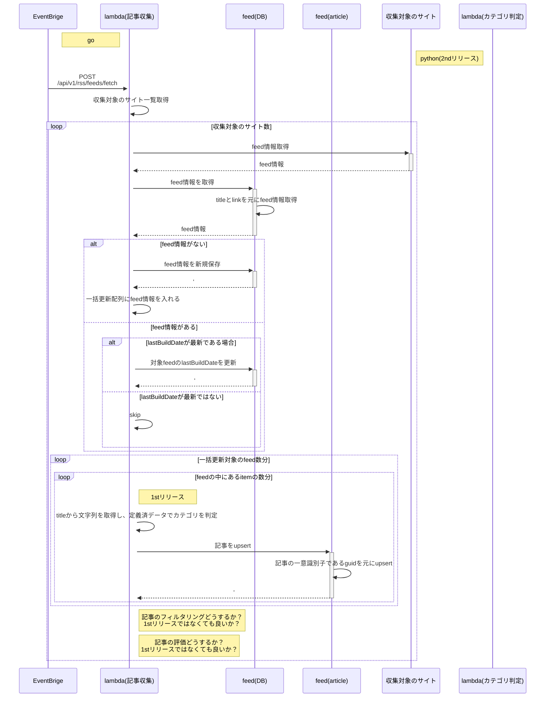
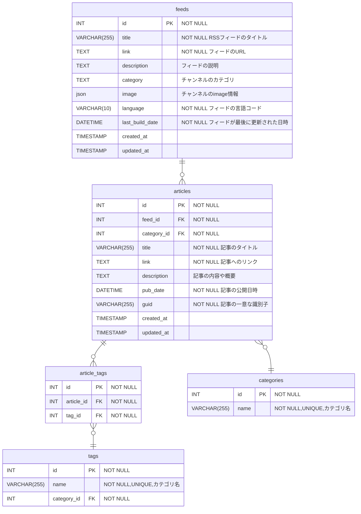

※情報として少し古いですが、時間の関係上メンテはしてません

## 概要
- RSSよりデータを収集し、データをDBに記録する。

## 参考資料
- [3Q技術キュレーションサービス_要件機能整理 > 記事収集機能](https://docs.google.com/spreadsheets/d/155nc4Wu7NXVLMKXLMqCQahpgcdRng_H_izJ9feed(DB)ss0iw/edit?gid=2059564945#gid=2059564945&range=12:12)

- [収集対象](https://github.com/yamadashy/tech-blog-rss-feed/blob/c8300c582e76c95f1123d6519d0ded51202fffb5/src/resources/feed-info-list.ts#L30)

- [RSSタグ一覧](https://docs.google.com/spreadsheets/d/155nc4Wu7NXVLMKXLMqCQahpgcdRng_H_izJ9Dbss0iw/edit?gid=614395705#gid=614395705&range=1:18)

## 技術選定
- 記事収集機能: go
- カテゴリ判定: python(機械学習ライブラリ使うので)

## 残論点① categotyの判定
### 1stリリース
- [こちらのワード](https://docs.google.com/spreadsheets/d/155nc4Wu7NXVLMKXLMqCQahpgcdRng_H_izJ9Dbss0iw/edit?gid=651602187#gid=651602187)でラベリング

### 2stリリース
- 機械学習系のライブラリを活用して判定する:
  - [キーワードを使った文章のカテゴリー判定](https://qiita.com/zawa_tech/items/a215d16fd2dc833f4e0c)
  - [参考](https://developers.wonderpla.net/entry/2017/10/10/110000)
  - Google ColaboratoryでAPIサーバー立てることもできそう: [参考](https://qiita.com/k_0214/items/dcf14c74779eb9839577)
    - [ChatGPTのAPIをGoogle colabで使い倒してみる](https://note.com/nero1014/n/n09a2ce7843b8)
- カテゴリの信憑性
  - ユーザーがいいねをした時にその判定を信憑する
  - 流入数やセッション数で判定する？

## 記事収集機能設計
### 記事収集
* トリガー
  * 3hに1回
  * 毎日7:00~18:00まで

## DB設計

